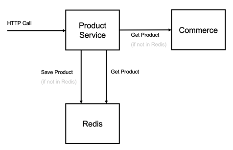

# Product Microservice

This example Spring Boot microservice for Kyma. The microservice retrieves Products by product code and site id using the same API format that is used by SAP Commerce (Rest Commerce Web Services aka OCC).

The Product data is stored in Redis. If the product service can't find the product in Redis it will make a call to SAP Commerce using OCC to retrieve the Product and store it in Redis.



## Setup

All ServiceInstances and ServiceBindings are created with yaml files however Redis instance needs to provisioned before the ServiceBinding and ServiceBindingUsage is created.


## Add the Redis Addon

From the Kyma console, add a new Cluster Addon with the following URL: https://github.com/kyma-project/addons/releases/download/latest/index-testing.yaml
 

### Deploy redis

```
kubectl apply -f redis/redis.yaml
```

Wait until the redis service instance is provisioned. Execute the command below and wait for the status to be 'READY'

```
kubectl get ServiceInstance redis 
```

## Build and Deploy

Skaffold is used to simplify the build and deployment process. 

Before the first deployment, change the docker image paths to match your own repository e.g.

deployment.yaml
```
spec:
      containers:
      - name: productservice
        image: docker.io/<changeme>/productservice
```

And change the hostname for the API to have a unique URL for the cluster (e.g. productservice-<namespace>)

api.yaml
```
api:
spec:
  authentication: []
  hostname: <changeme>
```

```
skaffold run --tail -t v1 --skip-tests=true
```

For development purposes you can also autodeploy and changes that you make.

```
skaffold dev --tail -t v1 --skip-tests=true
```

## Call Service

```
https://<hostname>.<cluster>.cluster.extend.cx.cloud.sap/electronics/products/2231913?fields=FULL
```

You can also access Swagger URL

```
https://<hostname>.<cluster>.cluster.extend.cx.cloud.sap/swagger-ui.html
```


